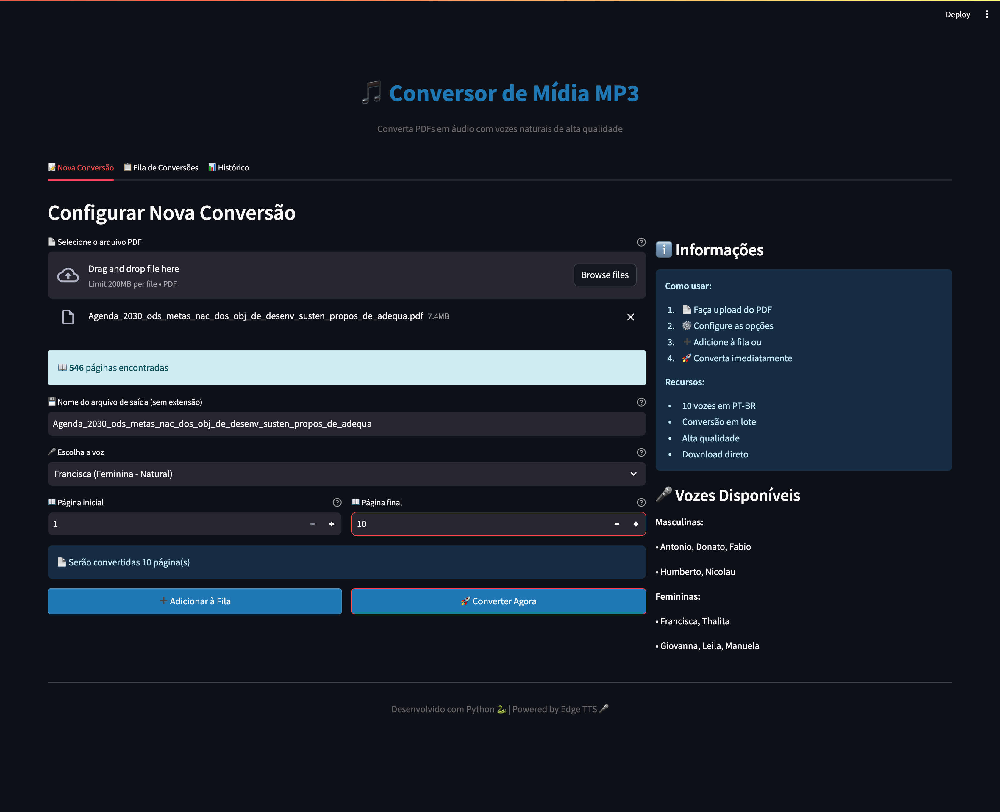
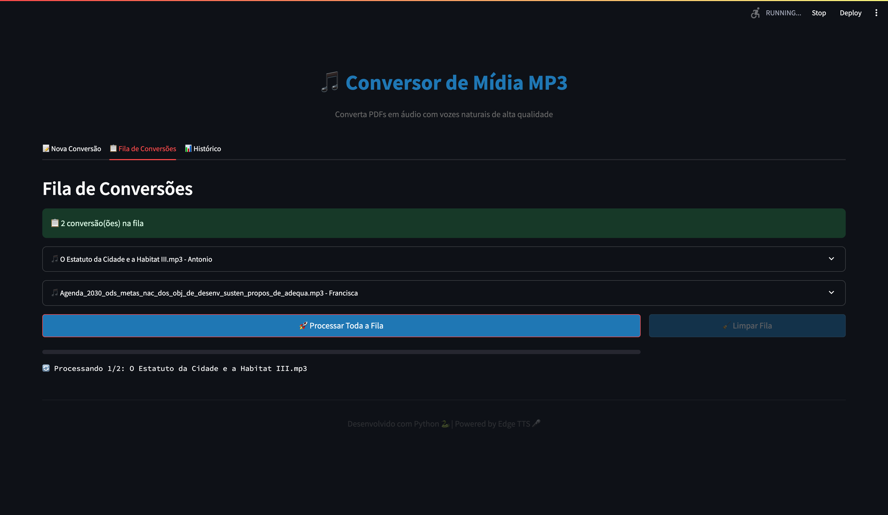
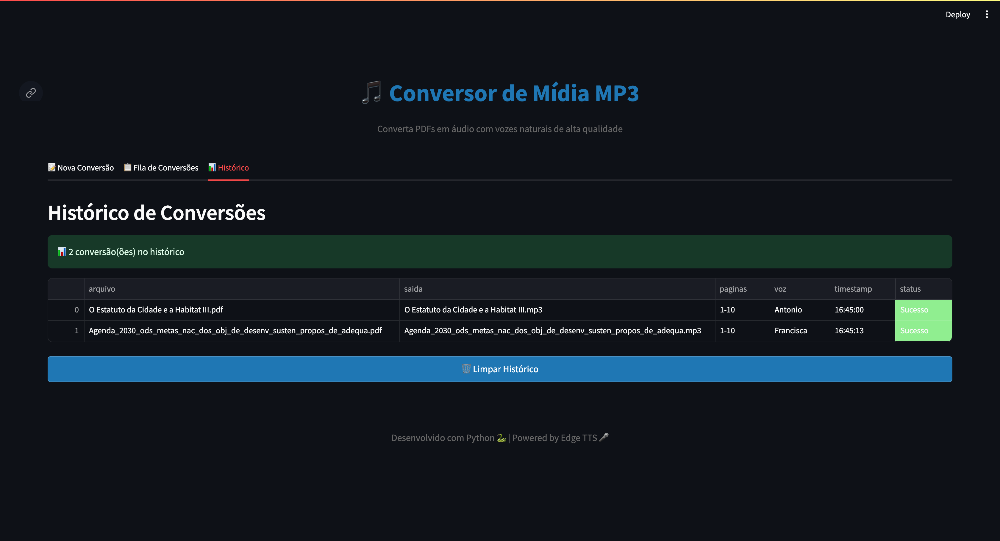

# PDF to MP3 Converter

<div align="center">


**Convert PDF documents to high-quality MP3 audio files using neural voices**

</div>

---

## About

PDF to MP3 Converter is a web application that transforms PDF documents into natural-sounding audio files using Microsoft's Edge TTS neural voices. Perfect for creating audiobooks, accessibility, or listening to documents on the go.

## Screenshots

<div align="center">

### Nova Conversão


### Fila de Conversões


### Histórico de Conversões


</div>

## Features

- **Web Interface** - Clean and intuitive Streamlit interface
- **10 Portuguese Voices** - Choose from masculine and feminine neural voices
- **Batch Conversion** - Queue multiple PDFs and convert them all at once
- **Page Selection** - Convert specific pages or page ranges
- **Real-time Progress** - Track conversion status with progress bars
- **Instant Download** - Download MP3 files directly from the browser
- **Conversion History** - Keep track of all your conversions
- **Cross-platform** - Works on Windows, macOS, and Linux

## Quick Start

### Prerequisites

- Python 3.7 or higher
- pip (Python package manager)

### Installation

```bash
# Clone the repository
git clone https://github.com/yourusername/pdftomp3.git
cd pdftomp3

# Install dependencies
pip install -r requirements.txt

# Run the application
streamlit run src/app.py
```

The app will open automatically in your browser at `http://localhost:8501`

### Windows Users

For convenience, Windows users can simply double-click [run.bat](run.bat) to start the application (requires Python to be installed).

**Important**: If you encounter installation errors on Windows, please check [WINDOWS_INSTALL.md](WINDOWS_INSTALL.md) for troubleshooting solutions.

## Usage

1. **Upload PDF** - Click to select your PDF file
2. **Configure** - Choose voice, output name, and page range
3. **Convert** - Click "Convert Now" for instant conversion or "Add to Queue" for batch processing
4. **Download** - Download your MP3 file

### Available Voices

| Voice | Type | Characteristic |
|-------|------|----------------|
| Antonio | Male | Natural and versatile |
| Francisca | Female | Natural and clear |
| Donato | Male | Deep and serious |
| Thalita | Female | Young and energetic |
| Fabio | Male | Energetic |
| Giovanna | Female | Smooth and calm |
| Humberto | Male | Mature and professional |
| Leila | Female | Professional |
| Manuela | Female | Calm and relaxing |
| Nicolau | Male | Young and dynamic |

## Project Structure

```
pdftomp3/
├── src/
│   └── app.py              # Main Streamlit application
├── images/                 # Screenshots for documentation
│   ├── nova-conversao.png
│   ├── fila-de-conversoes.png
│   └── historico-de-conversoes.png
├── output/                 # Generated MP3 files (git ignored)
├── examples/               # Example PDFs
├── requirements.txt        # Python dependencies
├── .gitignore             # Git ignore rules
├── LICENSE                # MIT License
├── CHANGELOG.md           # Version history
├── CONTRIBUTING.md        # Contribution guidelines
├── PUBLISH.md             # GitHub publication guide
├── run.bat                # Windows launcher script
├── launcher.py            # Python launcher for executables
├── build_exe.py           # Build Windows executable
└── README.md              # This file
```

## Technologies

- **[Python](https://www.python.org/)** - Core language
- **[Streamlit](https://streamlit.io/)** - Web framework
- **[PyPDF2](https://pypdf2.readthedocs.io/)** - PDF text extraction
- **[Edge TTS](https://github.com/rany2/edge-tts)** - Neural text-to-speech
- **[Pandas](https://pandas.pydata.org/)** - Data handling

## Building Windows Executable

To create a standalone Windows executable that doesn't require Python installation:

```bash
# Install PyInstaller
pip install pyinstaller

# Build executable
python build_exe.py
```

The executable will be created in the `dist/` folder.

## Contributing

Contributions are welcome! Here's how you can help:

1. Fork the repository
2. Create your feature branch (`git checkout -b feature/AmazingFeature`)
3. Commit your changes (`git commit -m 'Add some AmazingFeature'`)
4. Push to the branch (`git push origin feature/AmazingFeature`)
5. Open a Pull Request

### Ideas for Contributions

- Add support for more languages (English, Spanish, French, etc.)
- Improve UI/UX design
- Performance optimizations
- Audio quality settings (speed, pitch)
- Mobile-friendly interface
- Add tests
- Better documentation

## License

This project is licensed under the MIT License - see the [LICENSE](LICENSE) file for details.

## Acknowledgments

- Microsoft Edge TTS team for the amazing neural voices
- Streamlit team for the excellent web framework
- All contributors who help improve this project

## Support

- Report bugs or request features in the [Issues](https://github.com/yourusername/pdftomp3/issues) section
- Star this repo if you find it useful

## Roadmap

- [ ] Support for more languages (English, Spanish, French, etc.)
- [ ] Audio speed control
- [ ] Voice pitch adjustment
- [ ] Background music option
- [ ] Cloud storage integration
- [ ] API endpoints
- [ ] Docker support
- [ ] Mobile app

---

<div align="center">

**Made with ❤️ for the open source community**

</div>
